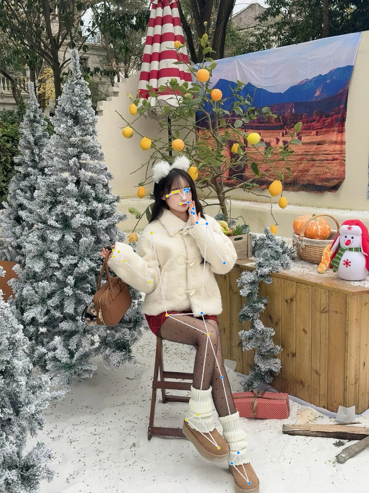
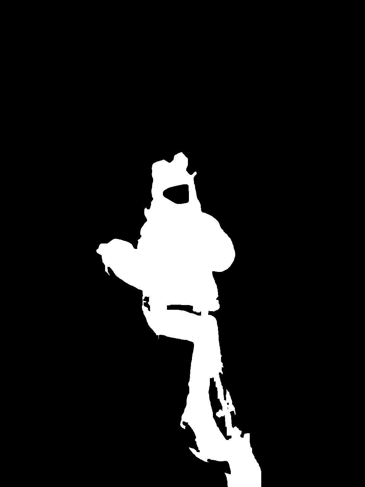
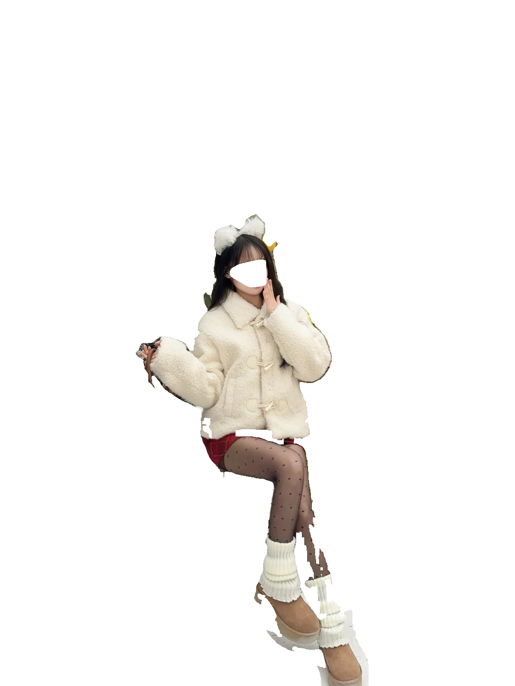

# 🎭 PoseMasterShear - AI 人物轮廓生成工具

> 一款基于 AI 的智能人物轮廓生成工具，结合 SAM 分割、深度估计和骨骼检测，实现高质量的人物抠图和轮廓提取，同时保护隐私。

## 🌟 特性

- 🤖 智能人体骨骼检测 (MediaPipe)
- 🎯 精确人物分割 (SAM)
- 🔍 深度辅助边缘优化
- ✨ 细节丰富的轮廓生成 (HED)
- 🎨 多种输出格式支持
- 🔒 智能人脸隐私保护

## 处理流程

1. **骨骼检测**
   - 使用 MediaPipe Pose 检测人体骨骼关键点
   - 为 SAM 提供精确的提示点
   - 同时获取人脸关键点用于人脸区域识别

2. **深度估计**
   - 使用 MiDaS 模型生成场景深度图
   - 基于骨骼关键点位置估计边缘深度
   - 仅在边缘区域应用深度过滤
   - 保持主体区域分割结果不变

3. **人物分割**
   - 使用 SAM 模型进行分割
   - 基于骨骼关键点进行精确定位
   - 在边缘区域结合深度信息优化分割
   - 使用人脸关键点创建自然的人脸遮罩
   - 通过渐变边缘平滑处理人脸区域
   - 通过参数控制分割质量：
     - mask_threshold: 0.95 (掩码阈值)
     - iou_threshold: 0.99 (IoU 阈值)
     - stability_score_thresh: 0.99 (稳定性分数阈值)

4. **人物抠图**
   - 基于分割结果生成带透明通道的人物图像
   - 保留原始图像的颜色信息
   - 自动移除人脸区域

5. **边缘检测**
   - 使用 HED 检测器生成细节丰富的边缘
   - 处理分辨率为 1024
   - 保持人脸区域的隐私保护

6. **输出处理**
   - 生成三个输出文件：
     - `*_mask.png`: 分割掩码
     - `*_person.png`: 人物抠图结果（带透明背景）
     - `*_outline.png`: 轮廓图像（带透明通道）
     - `*_pose.png`: 骨骼关键点��视化图像

## 依赖项

- segment-anything
- mediapipe
- controlnet_aux
- transformers
- torch >= 2.0
- opencv-python
- numpy
- Pillow

## 深度估计参数

### 深度阈值
- 使用人物关键点位置的深度作为参考
- 通过标准差控制深度容差范围：`depth_threshold = std_depth * 2`

### 边缘处理
- 使用形态学操作定义边缘区域：`kernel_size = 31`
- 仅在边缘区域应用深度过滤
- 保持主体区域分割结果不受深度影响

### 形态学处理
- 使用 5x5 核心进行闭运算，改善掩码质量
- 可以通过调整核心大小控制处理强度

### 设备选择
- 深度估计模型默认使用 CPU
- 在 Apple Silicon 设备上强制使用 CPU 以确保稳定性

## 使用方法

### 安装依赖
```bash
# 为 Apple Silicon (M1/M2/M3/M4) 安装 PyTorch
pip install torch torchvision torchaudio

# 安装其他依赖
pip install segment-anything mediapipe controlnet_aux opencv-python pillow
```

### 下载模型
1. 下载 SAM 模型权重文件 `sam_vit_b_01ec64.pth`
2. 将模型文件放在项目根目录

### 目录结构
```
PoseMasterShear/
├── main.py
├── pose_outline.py
├── sam_vit_b_01ec64.pth
└── test/
    ├── 1.jpg
    ├── 2.jpg
    └── ...
```

### 输出文件
程序会在输出目录生成���个文件：
- `2_mask.png`: 人物分割掩码
- `2_person.png`: 带透明背景的人物图像
- `2_outline.png`: 人物轮廓图像
- `2_pose.png`: 骨骼关键点可视化图像

## 输出示例

### 示例图片

| 输入图像 | 骨骼图 | 分割掩码 | 人物抠图 | 轮廓图 |
|:--------:|:--------:|:--------:|:------:|:------:|
|  |  |  |  |  |

### 输出说明
- 掩码图 (`*_mask.png`): 黑白二值图，显示分割结果
- 人物图像 (`*_person.png`): 带透明背景的原始人物图像
- 轮廓图像 (`*_outline.png`): 黑色背景的透明轮廓图
- 骨骼图像 (`*_pose.png`): 显示检测到的人体骨骼关键点和连接线

### 处理效果
- 精确的人物分割，有效去除背景
- 保持细节的同时移除噪点
- 自然的人脸区域移除
- 清晰的骨骼关键点标注

## 参数调优

### SAM 参数

- `mask_threshold`: 控制掩码生成的阈值（0-1）
  - 值越大，分割越严格，背景噪点越少
  - 值越小，分割越宽松，可能包含更多细节
  - 默认值：0.7

- `iou_threshold`: 控制区域重叠的阈值（0-1）
  - 值越大，分割区域越精确，重叠区域处理越严格
  - 值越小，分割更宽松，可能包含更多连接区域
  - 默认值：0.98

- `stability_score_thresh`: 控制分割稳定性的阈值（0-1）
  - 值越大，分割结果越稳定，噪点越少
  - 值越小，分割更灵活，可能包含更多细节区域
  - 默认值：0.98

### 去除背景噪点建议
1. 提高 `mask_threshold` 到 0.8-0.9
2. 提高 `stability_score_thresh` 到 0.99
3. 保持 `iou_threshold` 在 0.98 左右

示例配置：
```python
# 严格的噪点控制
self.predictor.model.mask_threshold = 0.85
self.predictor.model.stability_score_thresh = 0.99
self.predictor.model.iou_threshold = 0.98

# 平衡的配置
self.predictor.model.mask_threshold = 0.7
self.predictor.model.stability_score_thresh = 0.98
self.predictor.model.iou_threshold = 0.98

# 保留更多细节
self.predictor.model.mask_threshold = 0.6
self.predictor.model.stability_score_thresh = 0.95
self.predictor.model.iou_threshold = 0.95
```

### 边缘检测参数

- `detect_resolution`: 控制边缘检测的分辨率

### 人脸处理参数

- 人脸区域扩展：使用 15x15 核心进行膨胀
- 边缘平滑：使用 21x21 高斯模糊

## 注意事项

1. 确保输入图像中有清晰可见的人物
2. 建议使用高质量的输入图像以获得���好的效果
3. 可能需要根据具体图像调整参数
4. 人脸区域会被自动移除以保护隐私

### GPU 支持
- 程序会自动检测是否有可用的 GPU
- 如果有 CUDA 设备，会自动使用 GPU 加速
- 可以通过设置 device 参数手动指定使用 CPU 或 GPU

### Apple Silicon (M1/M2/M3/M4) 优化
- PyTorch 会自动使用 Metal Performance Shaders (MPS) 后端
- 可以通过设置 device="mps" 来使用 Metal 加速

```python
# 检测 MPS 可用性
if torch.backends.mps.is_available():
    device = "mps"
else:
    device = "cpu"

# 初始化生成器
generator = PoseOutlineGenerator(
    sam_checkpoint=model_path,
    model_type="vit_b",
    device=device
)
```
