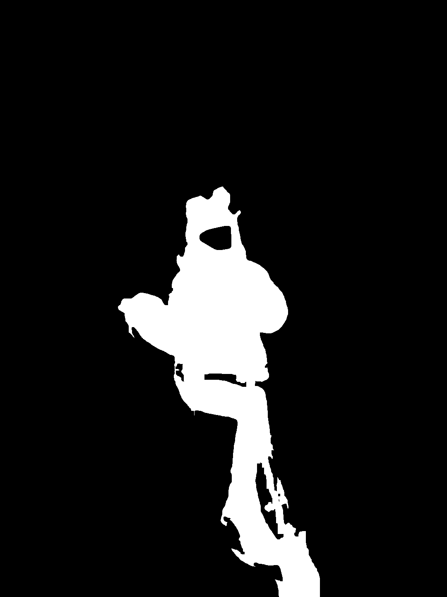

# 🎭 PoseMasterShear - AI 人物轮廓生成工具

[English Documentation](README.md)

> 一款基于 AI 的智能人物轮廓生成工具，结合 SAM 分割、深度估计和骨骼检测，实现高质量的人物抠图和轮廓提取，同时保护隐私。

## 🌟 特性

- 🤖 智能人体骨骼检测 (MediaPipe)
- 🎯 精确人物分割 (SAM)
- 🔍 深度辅助边缘优化
- ✨ 细节丰富的轮廓生成 (HED)
- 🎨 多种输出格式支持
- 🔒 智能人脸隐私保护

## 效果展示

| 输入图像 | 骨骼图 | 分割掩码 | 人物抠图 | 轮廓图 |
|:--------:|:------:|:--------:|:--------:|:------:|
|  |  |  |  |  |

## 快速开始

### 安装依赖
```bash
# 为 Apple Silicon (M1/M2/M3/M4) 安装 PyTorch
pip install torch torchvision torchaudio

# 安装其他依赖
pip install segment-anything mediapipe controlnet_aux opencv-python pillow transformers
```

### 使用方法
```python
generator = PoseOutlineGenerator(
    sam_checkpoint="sam_vit_b_01ec64.pth",
    model_type="vit_b",
    device="mps"  # 或 "cuda"/"cpu"
)

generator.process_image("input.jpg", "output.png")
```

## 处理流程

1. **骨骼检测**
   - 使用 MediaPipe Pose 检测人体骨骼关键点
   - 为 SAM 提供精确的提示点
   - 同时获取人脸关键点用于人脸区域识别

2. **深度估计**
   - 使用 MiDaS 模型生成场景深度图
   - 基于骨骼关键点位置估计边缘深度
   - 仅在边缘区域应用深度过滤
   - 保持主体区域分割结果不变

3. **人物分割**
   - 使用 SAM 模型进行分割
   - 基于骨骼关键点进行精确定位
   - 在边缘区域结合深度信息优化分割
   - 使用人脸关键点创建自然的人脸遮罩
   - 通过渐变边缘平滑处理人脸区域
   - 通过参数控制分割质量：
     - mask_threshold: 0.95 (掩码阈值)
     - iou_threshold: 0.99 (IoU 阈值)
     - stability_score_thresh: 0.99 (稳定性分数阈值)

## 输出文件

- 掩码图 (`*_mask.png`): 黑白二值图，显示分割结果
- 人物图像 (`*_person.png`): 带透明背景的原始人物图像
- 轮廓图像 (`*_outline.png`): 黑色背景的透明轮廓图
- 骨骼图像 (`*_pose.png`): 显示检测到的人体骨骼关键点

## 参数调优

### SAM 参数
- `mask_threshold`: 控制掩码生成 (0-1)
- `iou_threshold`: 控制区域重叠 (0-1)
- `stability_score_thresh`: 控制分割稳定性 (0-1)

### 边缘处理
- 边缘区域定义: `kernel_size = 31`
- 深度过滤仅应用于边缘
- 保持主体区域不变

### 形态学处理
- 使用 5x5 核心进行闭运算
- 可调整核心大小控制强度

## 设备支持

### GPU 支持
- 自动检测可用的 GPU
- 支持 CUDA 加速
- 可手动指定设备

### Apple Silicon 优化
- 自动使用 Metal Performance Shaders (MPS) 后端
- 通过 `device="mps"` 使用 Metal 加速

## 注意事项

1. 确保输入图像中有清晰可见的人物
2. 建议使用高质量的输入图像以获得更好的效果
3. 可能需要根据具体图像调整参数
4. 人脸区域会被自动移除以保护隐私

## 依赖项

- segment-anything
- mediapipe
- controlnet_aux
- transformers
- torch >= 2.0
- opencv-python
- numpy
- Pillow
